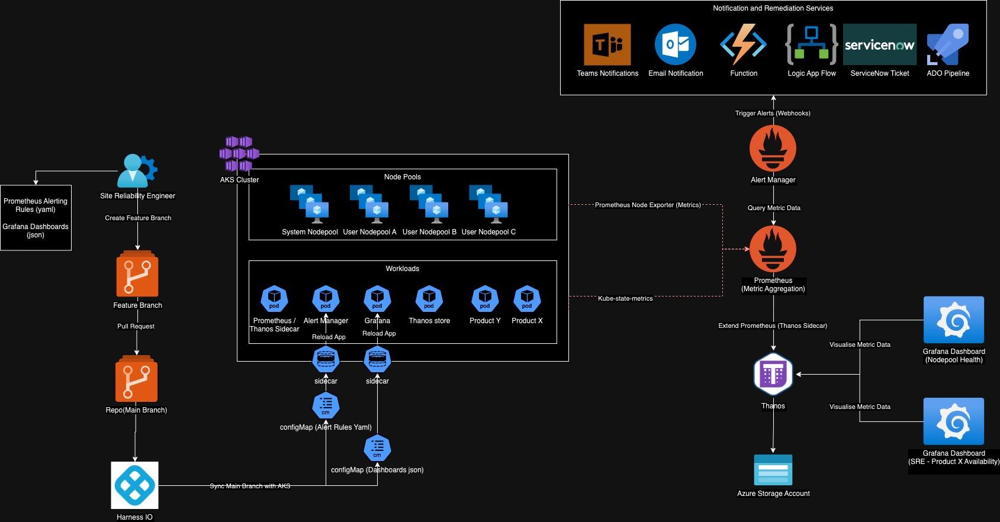

# Observability Platform for Kubernetes

## Overview

The following diagram is a high level example of running the Observability Platform in a Kubernetes cluster. The platform is composed of the following components:

- Prometheus
- Grafana
- Thanos
- alertmanager
- Azure Storage Account

Prometheus is integrated with Thanos, to enable log term storage of metrics in an object storage (Azure Storage Account). Grafana is used to visualize the metrics stored in the object storage bucket. Alertmanager is used to send alerts to teams, pipelines, etc using webhooks.

An approach to deploy the Observability Platform in a Kubernetes cluster is to use Helm charts.

One approach to deploy alerting rules and dashboard could be to use configMaps, following a gitOps approach. When a change is made to the configMap, a pr is approved merged into the main branch, the change is automatically applied to the cluster using Harness IO the sync the changes with the cluster. A sidecar is also provision with the containers using the configMap, to monitor the changes and reload the configuration when a change is detected.

## Architecture

